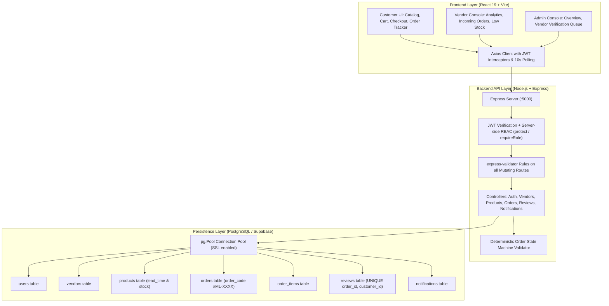
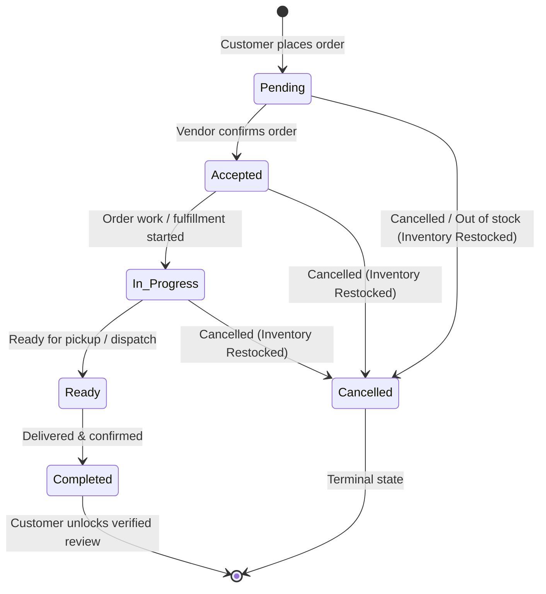

# MarketLink System Architecture Overview
**Item 03 Submission Document — System Architecture Diagram & Technical Rationale**

---

## 1. High-Level Architecture Diagram



---

## 2. Order Placement Transaction Workflow

```mermaid
sequenceDiagram
    autonumber
    actor Customer
    participant React as React Frontend (/checkout)
    participant API as Express API (/api/orders)
    participant PG as PostgreSQL (Supabase)

    Customer->>React: Clicks "Place Order"
    React->>API: POST /api/orders (JWT Bearer Token, Items, Address)
    API->>PG: BEGIN Transaction
    API->>PG: SELECT * FROM vendors WHERE id = $1 (Status check)
    loop For Each Item in Cart
        API->>PG: SELECT * FROM products WHERE id = $1 FOR UPDATE (Row Lock)
        Note over API,PG: Verifies sufficient stock; prevents concurrent race conditions
        API->>PG: UPDATE products SET stock_quantity = stock_quantity - qty
    end
    API->>PG: INSERT INTO orders (order_code, total, status='pending')
    API->>PG: INSERT INTO order_items (order_id, product_id, price, qty)
    API->>PG: INSERT INTO notifications (Vendor alert & Customer receipt)
    API->>PG: COMMIT Transaction
    API-->>React: 201 Created (Order Object with code #ML-XXXX)
    React-->>Customer: Redirects to /orders (Live Order Tracker)
```

---

## 3. Order State Machine Transition Pipeline

The order lifecycle adheres strictly to a deterministic state machine:



---

## 4. Key Architectural Decisions Defended

1. **Why PostgreSQL / Supabase over MongoDB**:
   - Order management is intrinsically relational: an order must reference a specific vendor, customer, and exact snapshot of line items.
   - Postgres native transactions (`BEGIN`, `COMMIT`, `ROLLBACK`) combined with `FOR UPDATE` row locks guarantee that inventory cannot be over-allocated even during concurrent checkout bursts.
2. **Why JWT Bearer Tokens over Server Sessions**:
   - Stateless authentication simplifies horizontal scaling and enables instant API deployment to serverless or containerized environments (Render, Vercel, Supabase) without sticky session overhead.
3. **Separate Management Sidebars for Vendor & Admin**:
   - Rather than crowding the customer navbar with managerial tabs, vendors and administrators operate inside an editorial sidebar console. This maintains a clean separation of concerns between the customer shopping experience and operational store management.
