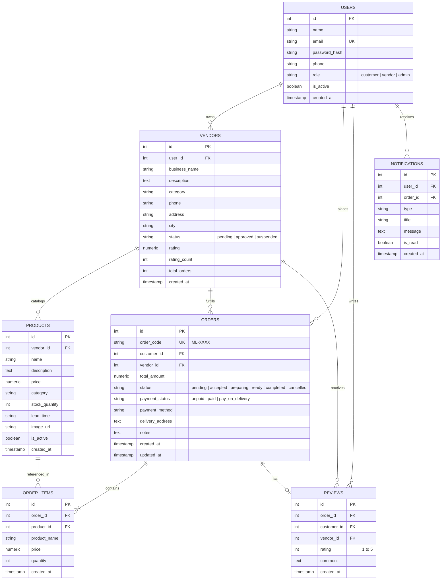

# MarketLink Database Design & ERD
**Item 04 Submission Document — Relational Schema & Entity Relationship Diagram**

---

## 1. Entity Relationship Diagram (ERD)



---

## 2. Table Specifications & Constraints

### 1. `users` Table
- Stores credentials, personal profile, and platform roles.
- **Constraints**:
  - `email` is enforced `UNIQUE`.
  - `role` checked against `'customer'`, `'vendor'`, `'admin'`.
  - `is_active` defaults to `true` (enables non-destructive suspension).

### 2. `vendors` Table
- Storefront information, verified rating aggregation, and admin approval status.
- **Constraints**:
  - `user_id REFERENCES users(id) ON DELETE CASCADE`.
  - `status` checked against `'pending'`, `'approved'`, `'suspended'`.
  - `rating` defaults to `NULL` (brand-new vendors show "New" rather than a fake 5-star rating).

### 3. `products` Table
- Real-time inventory and bookable local services.
- **Constraints**:
  - `vendor_id REFERENCES vendors(id) ON DELETE CASCADE`.
  - `stock_quantity >= 0`.
  - `lead_time` explicitly documents prep turnaround (e.g. *"20 min prep"* or *"Made to order (3 days)"*).

### 4. `orders` Table
- Core order transaction record.
- **Constraints**:
  - `order_code` is `UNIQUE NOT NULL` with `#ML-XXXX` format.
  - `customer_id REFERENCES users(id) ON DELETE RESTRICT`.
  - `vendor_id REFERENCES vendors(id) ON DELETE RESTRICT`.
  - `status` checked against valid state machine transitions.

### 5. `order_items` Table
- Snapshot record of purchased items.
- **Constraints**:
  - `order_id REFERENCES orders(id) ON DELETE CASCADE`.
  - `product_id REFERENCES products(id) ON DELETE RESTRICT`.
  - `quantity > 0`.

### 6. `reviews` Table
- Verified customer feedback for completed orders.
- **Constraints**:
  - `CONSTRAINT unique_order_customer_review UNIQUE(order_id, customer_id)` ensures duplicate reviews are impossible at the database engine level.
  - `rating BETWEEN 1 AND 5`.

### 7. `notifications` Table
- Real-time in-app notification center queue.
- **Constraints**:
  - `user_id REFERENCES users(id) ON DELETE CASCADE`.
  - `is_read` defaults to `false`.

---

## 3. Database Indexes

```sql
CREATE UNIQUE INDEX idx_users_email ON users(email);
CREATE INDEX idx_vendors_user_id ON vendors(user_id);
CREATE INDEX idx_vendors_status ON vendors(status);
CREATE INDEX idx_products_vendor_id ON products(vendor_id);
CREATE INDEX idx_products_category ON products(category);
CREATE INDEX idx_orders_customer_id ON orders(customer_id);
CREATE INDEX idx_orders_vendor_id ON orders(vendor_id);
CREATE INDEX idx_orders_status ON orders(status);
CREATE INDEX idx_order_items_order_id ON order_items(order_id);
CREATE INDEX idx_notifications_user_id ON notifications(user_id);
```
